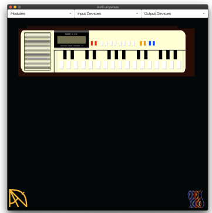

# About

This repo is part of a larger project called Audio Anywhere (AA). Audio Anywhere a 
framework for work-ing with audio plugins that are compiled once and run anywhere.
At the heart of Audio Anywhere is an audio engine whose Digital Signal Processing (DSP) components are written in Faust and deployed with WebAssembly. 

Details about the project can be found on the [project's homepage](https://muses-dmi.github.io/projects/).

## Introduction

An example implementation of a Audio Anywhere standalone application for desktop.



Support is provided for hot loading single AA modules or a chain of AA modules that 
form an audio graph, along with their corresponding interfaces. The modules 
are written in WASM and are compiled once to conform to the AA WASM API. 

## Building

It is implemented using stable [Rust](https://www.rust-lang.org/).

To install Rust go you need simply to install [Rustup](https://rustup.rs/) and 
if you already have Rust installed, then you can update with the command rustup update.

You can build with the following cargo command:

```bash
cargo build --release
```

Go get a coffee.

### Limitations

Currently I have tested it only on Mac OS and as it is dependent on Portaudio it 
possible that one Windows there is some additional work to do. This is on the list 
of tasks to complete in the next few weeks.

# Running

While Audio Anywhere does not specify how interfaces are implemented for a 
particular platform, for this implementation they are written with HTML5. Instruments
can be defined as a collection of modules with a single user interface or they 
as a set of seperate modules with individual interfaces. Interfaces are "injected"
using an iframe, or a collection of iframes.

The applications interface is also written in HTML5 and to avoid issues with 
different domains the interface is served from the same server. The interface
conforms to a specifed API, however, beyond that it is independent of the
hosting application and thus is not contained within this repo. An example
interface and a set of example AA modules can be found [here]().

TODO: update with how to connect to a server with AA Modules

# License
© 2020 [Benedict R. Gaster (cuberoo_)](https://bgaster.github.io/)

Licensed under either of

 * Apache License, Version 2.0
   ([LICENSE-APACHE](LICENSE-APACHE) or http://www.apache.org/licenses/LICENSE-2.0)
 * MIT license
   ([LICENSE-MIT](LICENSE-MIT) or http://opensource.org/licenses/MIT)

at your option.

## Contribution

Unless you explicitly state otherwise, any contribution intentionally submitted
for inclusion in the work by you, as defined in the Apache-2.0 license, shall be
dual licensed as above, without any additional terms or conditions.
